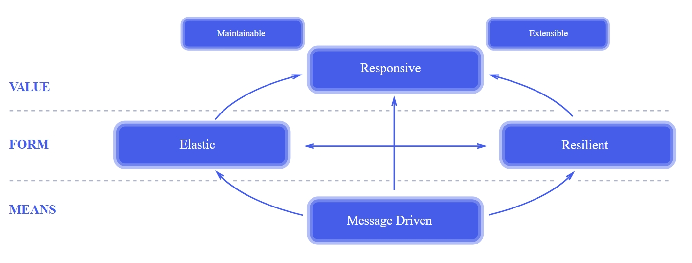
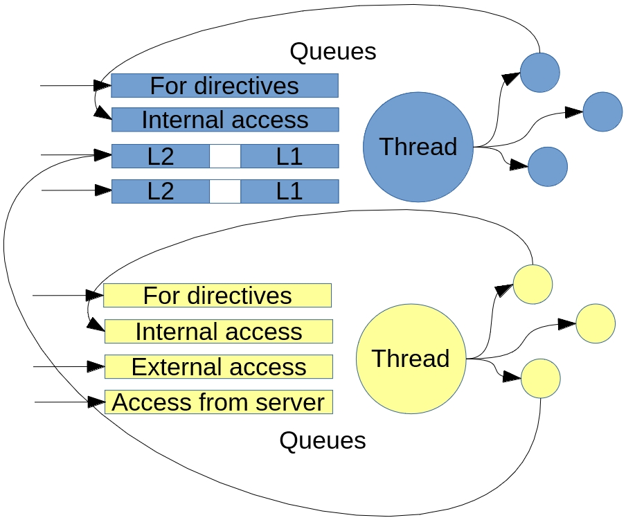
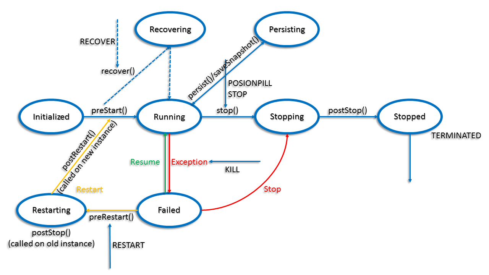
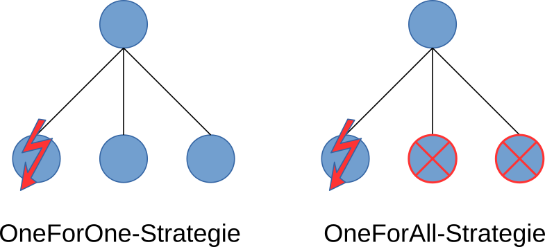

# Actor4j - Specification #

## Abstract ##

## License ##

This text is published under an Creative Commons License (CC BY). The reference implementation is licensed under Apache License 2.0.

## Revision History ##

| Revision | Date | Author(s) | Comments |
| :---: | :---: | :---: | :---: |
| Initial | Jan 27, 2020 | David A. Bauer | Initial draft |
| v0.1 | Feb 15, 2020 | David A. Bauer | Theoretical Background, Related Works, Use Cases |
| v0.2 | Feb 16, 2020 | David A. Bauer | Non-functional Requirements, Functional Requirements (Actor, Actor Types, Life Cycle, Life Cycle - Directives) |
| v0.3 | Feb 17, 2020 | David A. Bauer | Functional Requirements ( Actor Types, Monitoring, Supervision, Persistence, Execution) |

# Introduction #

This specification is primarly based on the paper by David A. Bauer et al. [[1](#1)] in 2018.

# Publications #

D. A. Bauer and J. Mäkiö, "Hybrid Cloud – Architecture for Administration Shells with RAMI4.0 Using Actor4j," 2019 IEEE 17th International Conference on Industrial Informatics (INDIN), Helsinki, Finland 2019, pp. 79-86, [Online]. Available from: https://doi.org/10.1109/INDIN41052.2019.8972075

D. A. Bauer and J. Mäkiö, “Actor4j: A Software Framework for the Actor Model Focusing on the Optimization of Message Passing,” AICT 2018: The Fourteenth Advanced International Conference on Telecommunications, IARIA, Barcelona, Spain 2018, pp. 125-134, [Online]. Available from: http://www.thinkmind.org/download.php?articleid=aict_2018_8_10_10087

# Actor Model #

The actor model is a mathematical model for describing concurrent and distributed processes (the actors themselves) [[2](#2)][[4](#4)]. Carl Hewitt [[3](#3)][[4](#4)] is considered as the inventor of the actor model. Actors have three basic properties [[2](#2)]. An actor can create additional actors [[2](#2)]. Actors can exchange messages with each other, these are immutable messages [[2](#2)]. This guarantees that actors do not have to share common resources in order to exchange information, but only do so via the immutable messages [[2](#2)]. This avoids possible synchronization problems that occur when accessing resources together when running concurrently [[2](#2)]. Actors are also characterized by behavior, which can be passive, reactive or proactive [[2](#2)]. That means an actor can react to a message by changing its behavior, which can influence the processing of the next message that the actor receives [[2](#2)]. An actor can also send a message to itself, which in turn can cause its behavior to change. The actor model is used, for example, in the programming language Erlang, which is used in WhatsApp, RabbitMQ, CouchDB and Amazon SimpleDB [[6](#6)]. The actor model is also suitable for simple modeling of complex communicative systems (high level of communication between actors of an associated actor group). It is ideal for simulating agent systems but also suitable for today's requirements, such as the Internet of Things (networking of devices) [[6](#6)]. Erlang (programming language with comparable concepts to the actor model) also introduces the supervision concept, which contributes particularly to the resilience of the system [[5](#5)]. In Erlang, a process corresponds to an actor. In the event of an error in a child process, the supervisor process (parent process) is notified, which decides how to proceed [[5](#5)]. The process can be restarted or ended, or even all direct child nodes of the supervisor process [[5](#5)].

# Reactive Systems #

A reactive system (see Figure 1) should be responsive, i.e. a system should be able to respond adequately depending on the requirements. The response times must be within the defined range, in particular to meet quality requirements and usability. The system must be resilient, i.e. fail-safe when an error occurs, the responsiveness must be further ensured. Replication, partitioning and the concept of supervision as an example are the means of choice to counteract a failure. It is elastic, i.e. even when the system load changes, the system remains responsive by adapting the system to the new requirements (e.g. by using replication, partitioning or rebalancing). Reactive systems are message-oriented, they use asynchronous message communication and are characterized by non-blocking behavior. This means that the system is always ready to respond [[7](#7)].

Fig. 1: The Reactive Manifesto [[7](#7)]

<!--# Scalability #-->

# Related Works #

Actor4j is a Java framework based on the actor model. Actor4j is based on Akka as a reference implementation. Akka is in turn influenced by Erlang, especially by the supervision concept. A new thread pool architecture was designed (see Figure 2), specially designed for the message exchange between the actors. In contrast to Akka, with Actor4j not every actor has its own queue, but there are several task-specific queues that are localized to the assigned thread. Incoming messages are injected via the corresponding thread at the actor. Each actor is permanently assigned to a thread. With this new thread pool architecture, Actor4j has significantly better performance compared to Akka. By default, Akka uses a ForkJoinPool from the Java Concurrency library internally [[1](#1)].

Fig. 2: Thread pool architecture of Actor4j [[1](#1)]

In the standard thread pool architecture of Actor4j, four task-specific queues are provided for each thread, one for accepting messages from actors belonging to the same thread, one for accepting messages from actors of another thread, one for accepting messages from the server and a special prioritized one queue to process internal directives. This procedure makes it possible to dispense with synchronization means, in particular when exchanging messages on the same thread, which significantly increases the performance. All queues are served equally, with the exception of the directive queue, so that the message processing of a queue is not blocking. Another mechanism that was built in is two-level queues, one with synchronization means for external access (external thread access) and one for internal use on the same thread without synchronization means, this also contributes to better performance depending on the application. Necessary blocking operations must be outsourced to special `ResourceActors` to ensure that the system is ready to respond. `ResourceActors` run in their own thread pool [[1](#1)].

# Use Cases #

- Multi-agent systems (MAS)
- Simulations
- Games (MMOG, MMORPG)
- Business Process Modeling (BPM)
- Business logic (for Client-Server architectures)
- Caching
- In-memory databases
- Databases (see CouchDB, Amazon SimpleDB)
- Messaging (see WhatsApp, RabbitMQ)
- Reactive Streams (with back pressure)
- Reactive Systems (responsive, elastic, resilient and message driven)
- Internet of Things
- Digital representatives of devices (see Device Shadows, AWS IoT)
- Functions (here actors) as nano services
- Batch-processing and stream-processing

(Adapted list from [[6](#6)])

# Requirements #

## Functional Requirements ##
The following keywords are highlighted: `MUST`, `SHOULD` and `CAN`. `MUST` mean that the requirement must be fully met. `SHOULD` means that the requirement can be deviated from in justified cases. `CAN` means that it is an optional requirement. Partially based on the documentation on [[6](#6)].

### Actor ###

Actor 1: Every actor `MUST`be associated with an actor cell, that contains the actor.

Actor 2: The system logic of the actor `MUST` be implemented within the actor cell, that acts as a wrapper.

Actor 3: Every actor `MUST` have a unique ID.

Actor 4: Every actor `MUST` have a parent actor.

Actor 5: Every actor `MUST`be adressable through a path.

Actor 6: Every actor `MUST` have a method handler for receiving messages. The corresponding message is injected.

Actor 7: Every actor `MUST` have the ability to send messages to other actors.

Actor 8: An alias `MUST` be associable with an actor, for easier addressing.

Actor 9: Every actor `MUST` have the ability to create child actors.

Actor 10: A message `MUST` consist of a payload, a tag for differentiating between messages, sender address, receiver address, interaction ID, interaction protocol  and an ontology.

### Actor Types ###

Actor Types 1: Actors within the actor system `MUST` be derived from the class `Actor`. Actors of this type `MUST` not have blocking behavior.

Actor Types 2: Workload tasks `MUST` not be performed within the actor system. Because they block the reactive system and it is no longer responsive. Therefore the class `ResourceActor` is provided. These special actors are executed in a separate thread pool, thus avoiding disturbances within the actor system. It `SHOULD` be distinguished between stateless and stateful actors. The advantage of this distinction lies in the fact that stateless actors can be executed in parallel.

Actor Types 3: A `PseudoActor` is a mediator between the outside world and the actor system. It allows communication with the actors within the actor system from the outside. Unlike the other actors, the `PseudoActor` `MUST` have its own message queue, in which the messages of other actors can then be stored by the actor system.

Actor Types 4: To persist the state of an actor, this `MUST` be derived from the `PersistentActor` class. A `PersistentActor` is characterized by events and a state, which can be saved, depending on use case.

### Life Cycle ###

Life Cycle 1: Every actor `MUST` be activatable or deactivatable (ignoring ingoing messages, except internal messages).

Life Cycle 1: After instantiation the actor `MUST` call the method `preStart`. This method is used for first initializations of the actor.

Life Cycle 2: If the actor is a derivative of the `PersistenActor` it `MUST` execute the recover protocoll. The actor `MUST` be deactivated until the actor gets the recover data from the persistent system. After that the method `recover` `MUST` be called. This method recoveres then the state of the actor. 

Life Cycle 3: An actor `MUST` also be restartable, usually triggered by an exception. In this case, on the old instance `preRestart` `MUST` be called first. Then a new instance `MUST` be generated with the dependency injection container. The old instance `MUST` be replaced by the new instance, and the method `postRestart` `MUST` be called by the new instance. The `preRestart` and `postRestart` methods are used so that the actor can react adequately to the situation of the restart. The marking (UUID) of the original actor `MUST` be retained. This guarantees that references from other actors to this actor will stay valid. 

Life Cycle 4: An actor `MUST` be stoppable either by calling the `stop` method or by receiving the `STOP` or `POISONPILL` message.

### Life Cycle - Directives ###

There `MUST` be supported eight directives: `RESUME`, `STOP`, `TERMINATED`, `RESTART`, `ESCALATE`, `RECOVER`, `ACTIVATE` and `DEACTIVATE`. Stopping, restarting and recovering of the actors `MUST` be asynchronous.

- `RESUME`: In this case, the supervisor remains passive. The actor can continue its activities undisturbed.
- `STOP`: 
	- To all children the message `STOP` is be sent (recursive process, if the children also have children) so that they can terminate. Use of `watch`, to observe that all children have terminated.
	- Call of `postStop`.
- `TERMINATED`: Actor is stopped.
- `RESTART`:
	- `PreRestart` is called at the current instance.
	- To all children the message `STOP` is sent (recursive process, if the children also have children) so that they can terminate. Use of `watch`, to observe that all children have terminated.
	- Call of `postStop` at the current instance, after all children have finished and confirmed this with the `TERMINATED` message.
	- Instantiate a new instance with the dependency injection container. It is ensured that the `UUID` is maintained.
	- Call of `postRestart` (with `preStart` (with optional `recover`) for the new instance.
- `ESCALATE`: If a supervisor is unclear as to what the correct strategy is in the event of a specific error, he can pass it on to his superior supervisor for clarification.
- `RECOVER`: The actor will be recovered to it's last state, novel events can lead to an update of the actor's state.
- `ACTIVATE` and `DEACTIAVTE`: Activates or deactivates the actor (messages will be or not longer processed). The current explained directives remains deliverable, even when the actor is deactivated.

Fig. 3: Extended representation of the life cycle of an actor [[6](#6)]

### Monitoring ###

An actor `MUST` also have the option to monitor another actor for that it has not yet terminated itself. If the observed actor is terminated, a message `TERMINATED` is sent to the observer.

### Supervision ###

Supervision 1: The supervisor actor `MUST` monitors its child actors, in the event of an error, they are resumed or restarted or stopped by them.

Supervision 2: Two strategies `MUST` be foreseen (see Fig. 4). In the `OneForOne-Strategy`, only the affected actor `MUST` be considered. In the `OneForAll-Strategy`, on the other hand, not only the affected actor `MUST` be considered but also the neighbouring actors (below the supervisor actor).

Fig. 4: OneForOne-Strategy and OneForAll-Strategy [[6](#6)]

### Persistence ###

Persistence 1: The principles of event sourcing `MUST` be followed.

Persistence 2: Events and states snapshots of an actor `MUST` be saveable.

Persistence 3: A recovery of the last state `MUST` be possible, by replaying the events since the last state snapshot, in case of an error.

### Execution ###

Execution 1: Each actor `MUST` be permanently assigned to a thread.

Execution 2: Four task-specific queues `SHOULD` be provided for each thread, one for accepting messages from actors belonging to the same thread, one for accepting messages from actors of another thread, one for accepting messages from the server and a special prioritized one queue to process internal directives.

Execution 3: All queues `SHOULD` served equally (by defining a fixed throughput), with the exception of the directive queue, so that the message processing of a queue is not blocking.

Execution 4: The directive queue `MUST` be served first, to maintain the consistency of the system.

Execution 5: Two-level queues architecture `SHOULD` be established, one with synchronization means for external access (external thread access) and one for internal use on the same thread without synchronization mean. 

Execution 6: Incoming messages `MUST` be injected via the corresponding thread at the actor.

## Non-functional Requirements ##

NF 1: Ensures `High Reponsiveness` for their clients (see concept of thread pool architecture, actors are receiving messages in sequential order from the sender).

NF 2: Ensures `Non-Blocking Behavior` through asynchronous communication style (also related to responsiveness, for computationally intensive tasks there exist an extra thread pool, in Actor4j this actors are called resource actors).

NF 3: Ensures `High Resilience` (Robustness) through the supervision concept (see also Erlang, restarting of actors in occurrence of failure)

NF 4: Ensures `Simplicity` in modeling an actor in a concurrent environment (key-concept of the actor model, all actors are executed in a safe place, no corruption in state possible by using immutable objects for communication between actors).

<!--# Conception #-->

# Implementation #

Reference implementation for Actor4j can be found under following link: https://github.com/relvaner/actor4j-core, as well additional libraries for Actor4j (see: https://github.com/relvaner?utf8=%E2%9C%93&tab=repositories&q=actor4j&type=&language=).

<!--# Evaluation #-->

# Conclusion #

# References #
[1]<a name="1"/> D. A. Bauer and J. Mäkiö, “Actor4j: A Software Framework for the Actor Model Focusing on the Optimization of Message Passing,” AICT 2018: The Fourteenth Advanced International Conference on Telecommunications, IARIA, Barcelona, Spain 2018, pp. 125-134, [Online]. Available from: http://www.thinkmind.org/download.php?articleid=aict_2018_8_10_10087

[2]<a name="2"/> D. A. Bauer and J. Mäkiö, "Hybrid Cloud – Architecture for Administration Shells with RAMI4.0 Using Actor4j," 2019 IEEE 17th International Conference on Industrial Informatics (INDIN), Helsinki, Finland 2019, pp. 79-86, [Online]. Available from: https://doi.org/10.1109/INDIN41052.2019.8972075

[3]<a name="3"/> C. Hewitt, P. Bishop, and R. Steiger, “A universal modular Actor formalism for artificial intelligence,” in 3rd International Joint Conference on Artificial Intelligence (IJCAI), pp. 235-245, 1973.

[4]<a name="4"/> C. Hewitt, “Actor Model of Computation: Scalable Robust Information Systems,“ v38. arXiv, 2015.

[5]<a name="5"/> J. Armstrong, “Programming Erlang - Software for a Concurrent World (Pragmatic Programmers),“ Pragmatic Bookshelf, pp 398-399, 2013.

[6]<a name="6"/> D. A. Bauer, "Actor4j," 2019, [Online]. Available from: https://github.com/relvaner/actor4j-core

[7]<a name="7"/> J. Bonér, D. Farley, R. Kuhn, M. Thompson, and Community, “The Reactive Manifesto,” 2014, [Online]. Available from: http://www.reactivemanifesto.org/  